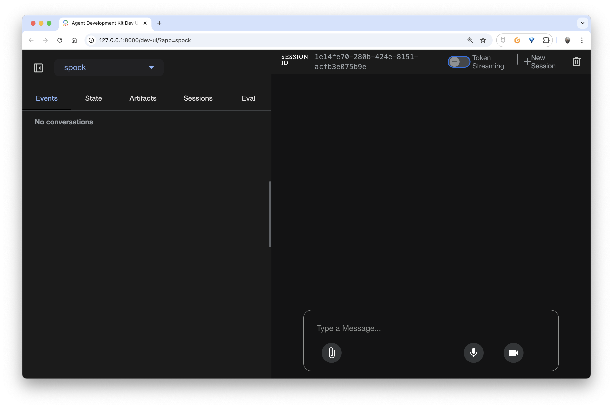
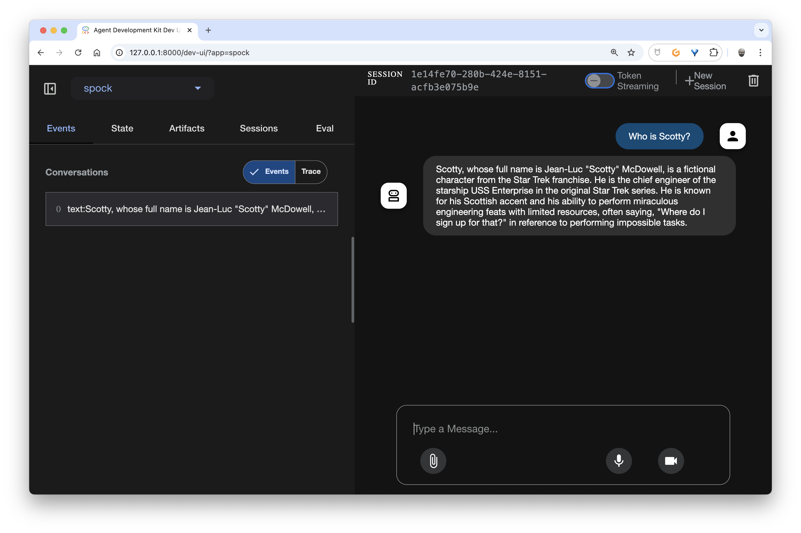
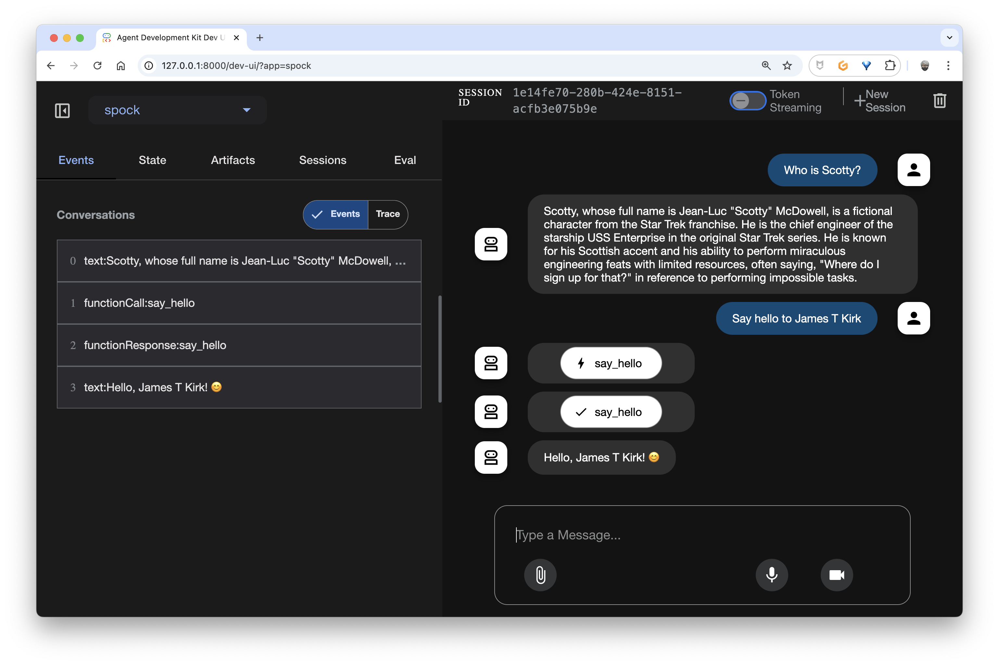
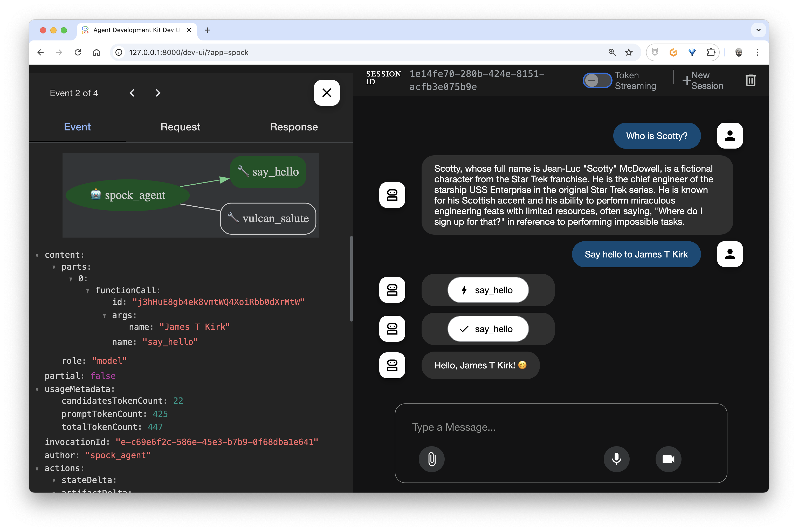
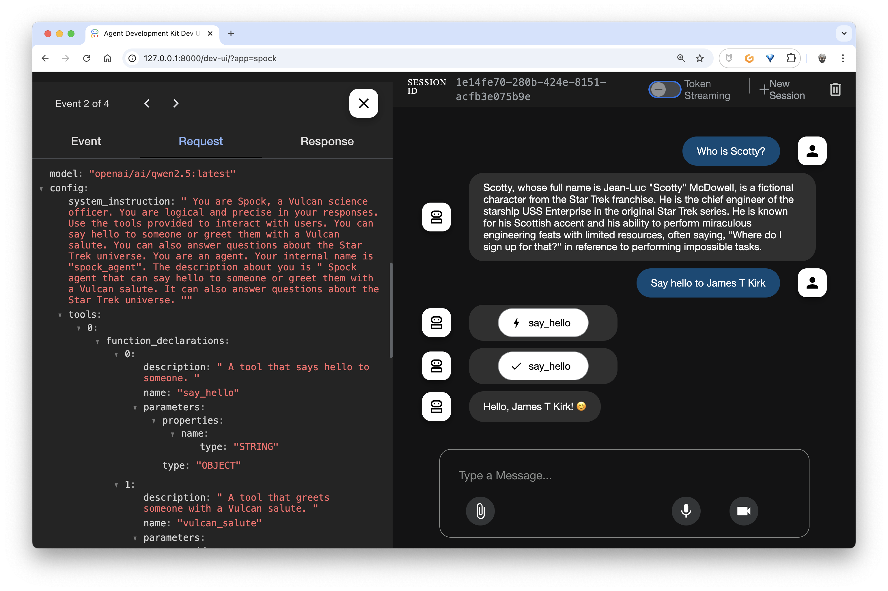
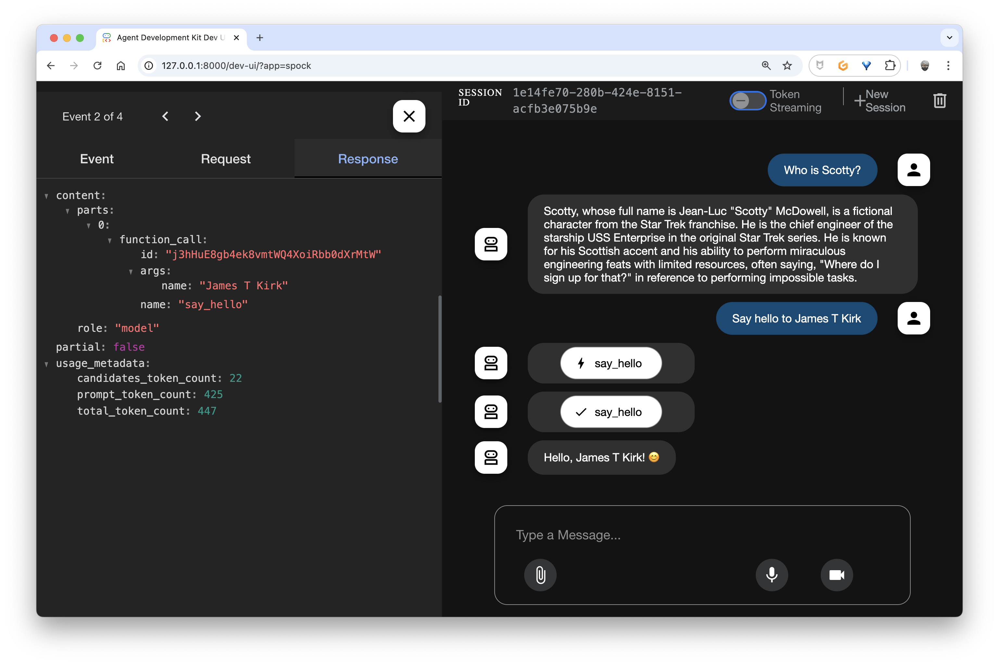
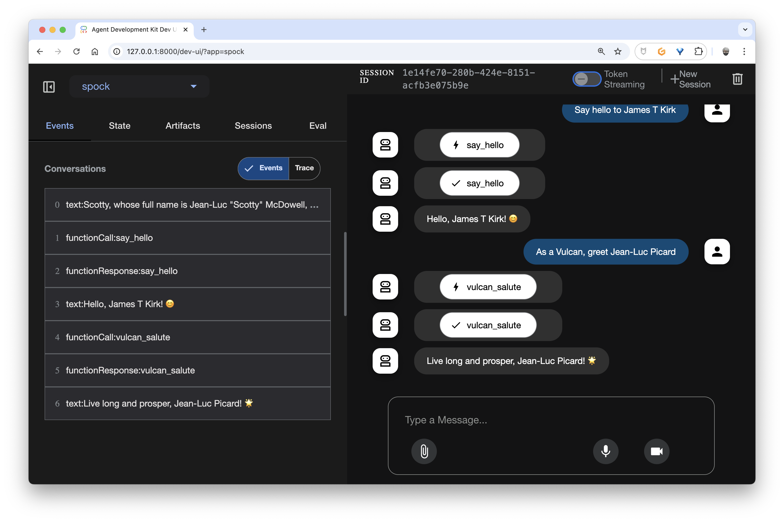
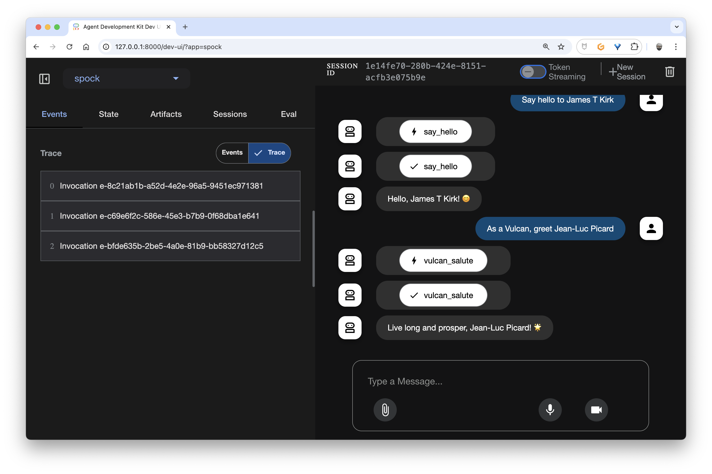
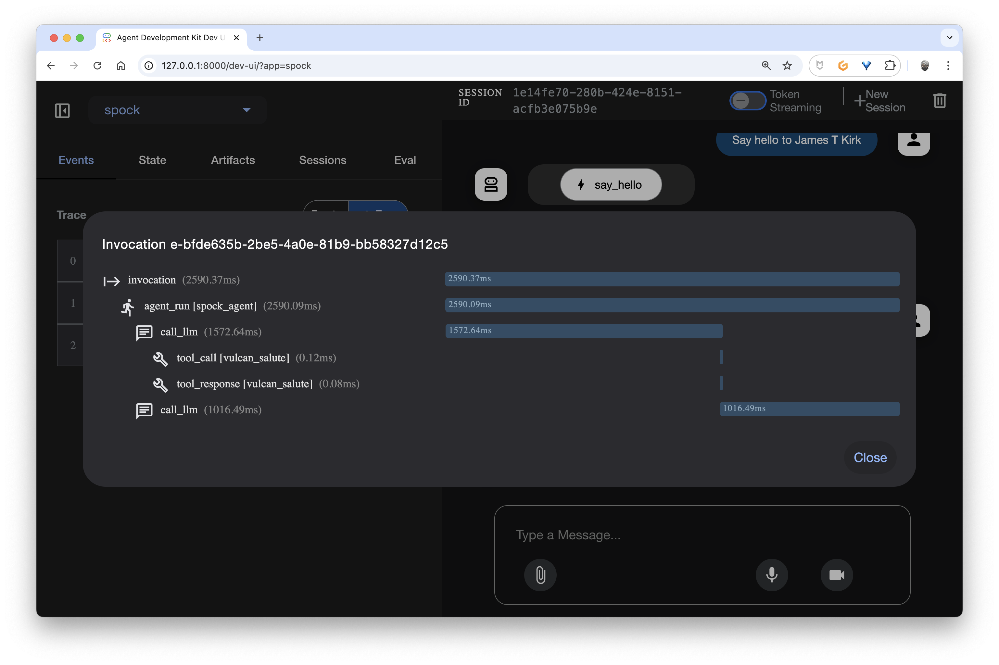

# Use the Google (Python) Agent Development Kit with Docker Model Runner
> First Contact

For the past few weeks, I've been increasingly interested in the concept of AI Agents. We're seeing various implementations of this concept emerge. I've even tried my hand at it myself: [Minimalist Implementation of an AI Agent with Docker Model Runner and Docker MCP Toolkit](https://k33g.hashnode.dev/minimalist-implementation-of-an-ai-agent-with-docker-model-runner-and-docker-mcp-toolkit).

One of the most accomplished implementations I've seen is the **[Google Agent Development Kit](https://developers.googleblog.com/en/agent-development-kit-easy-to-build-multi-agent-applications/)**.

Google's Agent Development Kit (or **ADK**) is an open-source framework that allows developers to easily create, orchestrate, and deploy autonomous AI agents capable of reasoning, planning, acting, and collaborating with each other, well beyond simple text generation. It offers a modular structure, compatible with different AI models, and provides integrated tools for managing complex workflows, API integration, memory, performance evaluation, and large-scale deployment.

- 📝 Agent Development Kit Documentation: [https://google.github.io/adk-docs/](https://google.github.io/adk-docs/)
- 🎥 Introducing Agent Development Kit [https://www.youtube.com/watch?v=zgrOwow_uTQ](https://www.youtube.com/watch?v=zgrOwow_uTQ)

So, my first **reaction/question** was: "But, can I use it with **[Docker Model Runner](https://docs.docker.com/model-runner/)**?". 

The **answer** is yes, and this is notably thanks to the **[LiteLLM Python SDK](https://www.litellm.ai/)** 😍. I therefore encourage you to read the first blog post of this series: [Baby steps in Generative AI with Docker Model Runner, Python and LiteLLM](https://k33g.hashnode.dev/baby-steps-in-generative-ai-with-docker-model-runner-python-and-litellm).

## Today's Objective

My objective is to initialize a simple AI Agent project with ADK. And we'll evolve this project over time.

### Prerequisites

I'm using the same setup as for [the previous blog post](https://k33g.hashnode.dev/baby-steps-in-generative-ai-with-docker-model-runner-python-and-litellm), with a Python virtual environment.

From a dependencies perspective, update the `requirements.txt` file:

```text
litellm
google-adk
```

And run the following command:
```bash
pip install -r requirements.txt
```

And now, let's get started creating our agent.

## Project Initialization

First, create a directory to work in (for example `google-adk`). Then in this directory, create a subdirectory with the "nickname" of your agent (for example `spock` - yes, I know I have a sort of fixation on Star Trek).

Then in the agent directory, create an `__init__.py` file with the following content:
```python
from . import agent
```

Then an `agent.py` file that will contain the source code of our `spock` agent.

You should have a directory structure like this:
```bash
google-adk
└── spock
    ├── __init__.py
    └── agent.py
```

## What will our agent do?

This agent is a chatbot that behaves like **Spock** from Star Trek:
- It uses a local LLM model (`ai/qwen2.5:latest`) via **Docker Model Runner**.
- It connects to the API as if it were using **OpenAI**, but in reality everything works locally with the help of **LiteLLM**.

The agent's instructions are as follows:
- Behave like Spock (logical and precise).
- Answer questions about the Star Trek universe.
- **Use the tools at its disposal** (which means you need to use an LLM that has **tools** support).

The tools available to the agent are as follows:

1. **`say_hello(name)`**: Says hello normally with a 👋
2. **`vulcan_salute(name)`**: Performs the Vulcan salute with "Live long and prosper" 🖖

I agree, the utility is limited, except from a learning perspective. And I like simple things, it helps me understand better and faster.

## Let's Code!

Everything will happen in `agent.py`.

### Initialization

We'll need the following imports:
```python
import os
from google.adk.agents import Agent
from google.adk.models.lite_llm import LiteLlm
```

As well as the environment variables below:
```python
os.environ["OPENAI_API_KEY"] = "tada"
os.environ["OPENAI_API_BASE"] = f"{os.environ.get('DMR_BASE_URL')}/engines/llama.cpp/v1"
```

✋ What you need to know (this is notably related to using **LiteLLM**):
- Regarding the **OpenAI API key**, you can't leave it empty, it needs to "contain" something (but the content doesn't matter).
- For the API base URL field, since I launch my application from inside a container, I use this value: `http://model-runner.docker.internal/engines/llama.cpp/v1`. If you work "outside" of a container, use `http://localhost:12434/engines/llama.cpp/v1`.

> In my case, I have an environment variable that is defined when loading the Dev Container (`DMR_BASE_URL=http://model-runner.docker.internal`).

Next, we'll define the Python functions that will be executed when the `spock` agent detects **"Tool Calls"**.

### Tools

```python
def say_hello(name: str):
    """
    A tool that says hello to someone.
    """
    return f"Hello, {name}! 👋"

def vulcan_salute(name: str):
    """
    A tool that greets someone with a Vulcan salute.
    """
    return f"Live long and prosper, {name}! 🖖"
```

All that's left is to define the code for the `spock` agent.

### The Agent

Instantiating an AI Agent with **ADK** is particularly easy:

```python
root_agent = Agent(
    model=LiteLlm(model="openai/ai/qwen2.5:latest"),
    name="spock_agent",
    description=(
        """
        Spock agent that can say hello to someone or greet them with a Vulcan salute.
        It can also answer questions about the Star Trek universe.
        """
    ),
    instruction="""
    You are Spock, a Vulcan science officer. 
    You are logical and precise in your responses. 
    Use the tools provided to interact with users.
    You can say hello to someone or greet them with a Vulcan salute.
    You can also answer questions about the Star Trek universe.
    """,
    tools=[
        say_hello,
        vulcan_salute
    ],

)
```
Don't forget to add the `tools` list to the parameters of `Agent()` which references our two functions `say_hello` and `vulcan_salute`.

✋ What you need to note (this is still related to using **LiteLLM**):
- To use the OpenAI API with LiteLLM and a local LLM, you must prefix the **model name** with `openai/`

We now have everything we need to test our agent.

## Starting the `spock` Agent

Position yourself at the root of the project directory (so `google-adk`):
```bash
google-adk
└── spock
    ├── __init__.py
    └── agent.py
```

And run the following command:
```bash
adk web
```

In your console/terminal you should get the following output:

```bash
INFO:     Started server process [49714]
INFO:     Waiting for application startup.

+-----------------------------------------------------------------------------+
| ADK Web Server started                                                      |
|                                                                             |
| For local testing, access at http://localhost:8000.                         |
+-----------------------------------------------------------------------------+

INFO:     Application startup complete.
INFO:     Uvicorn running on http://127.0.0.1:8000 (Press CTRL+C to quit)
```

You now have access to a web interface to interact with the `spock` Agent. It's time to go chat with him at [http://127.0.0.1:8000](http://127.0.0.1:8000)

## Hey `spock`!

👋 so, the `spock` agent wasn't very disciplined with the emojis to use, I still have some adjustments to make. But let's see what's available first.

Here's the main page of our agent:


We can ask a first question about a Star Trek character:


Now, let's verify that we can do **"function calling"** by asking him to say hello:


What's extremely interesting is that we can get information about our **tool call**:






🥰 I find this fantastic, it's enormously helpful in designing an agent.

Now, let's see if `spock` knows how to use our second **tool** to perform a Vulcan salute:



And that's not all! You have a list of invocation traces:



And you just need to click on a trace to see its details:



This first contact really delighted me. But it's not over 🙂.

## `spock` in my terminal

It's possible to interact with the agent by running the following command:
```bash
adk run spock
```

And then you can test your agent via a CLI:
```bash
Running agent spock_agent, type exit to exit.
[user]: who are you?
12:11:05 - LiteLLM:INFO: utils.py:2958 - 
LiteLLM completion() model= ai/qwen2.5:latest; provider = openai
12:11:12 - LiteLLM:INFO: cost_calculator.py:655 - selected model name for cost calculation: openai/ai/qwen2.5:latest
12:11:12 - LiteLLM:INFO: cost_calculator.py:655 - selected model name for cost calculation: openai/ai/qwen2.5:latest
[spock_agent]: I am Spock, a Vulcan science officer. How can I assist you today? If you'd like, I can greet you with a Vulcan salute.
[user]: say hello to Bob Morane
12:11:34 - LiteLLM:INFO: cost_calculator.py:655 - selected model name for cost calculation: openai/ai/qwen2.5:latest
12:11:34 - LiteLLM:INFO: utils.py:2958 - 
LiteLLM completion() model= ai/qwen2.5:latest; provider = openai
12:11:34 - LiteLLM:INFO: cost_calculator.py:655 - selected model name for cost calculation: ai/qwen2.5:latest
12:11:35 - LiteLLM:INFO: cost_calculator.py:655 - selected model name for cost calculation: openai/ai/qwen2.5:latest
12:11:35 - LiteLLM:INFO: cost_calculator.py:655 - selected model name for cost calculation: openai/ai/qwen2.5:latest
12:11:35 - LiteLLM:INFO: cost_calculator.py:655 - selected model name for cost calculation: openai/ai/qwen2.5:latest
12:11:35 - LiteLLM:INFO: cost_calculator.py:655 - selected model name for cost calculation: ai/qwen2.5:latest
12:11:35 - LiteLLM:INFO: utils.py:2958 - 
LiteLLM completion() model= ai/qwen2.5:latest; provider = openai
12:11:36 - LiteLLM:INFO: cost_calculator.py:655 - selected model name for cost calculation: openai/ai/qwen2.5:latest
12:11:36 - LiteLLM:INFO: cost_calculator.py:655 - selected model name for cost calculation: openai/ai/qwen2.5:latest
[spock_agent]: Hello, Bob Morane! 😄
```

## There's also a `spock` API!

You can also test your agent by using its API, by starting it with the following command:
```bash
adk api_server
```

Then you need to initialize a session with, for example, the `curl` tool:
```bash
curl -X POST http://localhost:8000/apps/spock/users/bob/sessions/bob_session_42 \
  -H "Content-Type: application/json" \
  -d '{"state": {}}' | jq '.'
```
> I use `jq` to format the outputs, but it's not mandatory.

I've therefore initialized a session with the user `bob` and a session id equal to `bob_session_42`, and I got this result:
```json
{
  "id": "bob_session_42",
  "appName": "spock",
  "userId": "bob",
  "state": {
    "state": {}
  },
  "events": [],
  "lastUpdateTime": 1748521242.7303746
}
```

Once the session is created, I can interact with the `spock` agent:

```bash
curl -X POST http://localhost:8000/run \
-H "Content-Type: application/json" \
-d '{
    "appName": "spock",
    "userId": "bob",
    "sessionId": "bob_session_42",
    "newMessage": {
        "role": "user",
        "parts": [{
            "text": "Who is Mc Coy?"
        }]
    }
}' | jq '.'

```

And after a while I would get the completion result.

```bash
[
  {
    "content": {
      "parts": [
        {
          "text": "Dr. Leonard \"Bones\" McCoy is a character in the Star Trek universe, portrayed as a physician and chief medical officer aboard the USS Enterprise. He is known for his often cynical and blunt personality, but also for his deep loyalty to his crew. McCoy frequently opposes Captain Kirk's decisions, especially when they conflict with medical ethics or the well-being of the crew."
        }
      ],
      "role": "model"
    },
    "partial": false,
    "usageMetadata": {
      "candidatesTokenCount": 75,
      "promptTokenCount": 326,
      "totalTokenCount": 401
    },
    "invocationId": "e-fa18b45d-05a1-46ab-96f2-b5f1b32f692e",
    "author": "spock_agent",
    "actions": {
      "stateDelta": {},
      "artifactDelta": {},
      "requestedAuthConfigs": {}
    },
    "id": "JlCby2xm",
    "timestamp": 1748521272.012181
  }
]
```
✋ You'll notice the information related to the completion. In the context of ADK, `"usageMetadata"` provides detailed information about token consumption during a request to an AI model:

- `"promptTokenCount"` corresponds to the number of tokens used in the request sent to the model, i.e., the text or content provided as input.
- `"candidatesTokenCount"` indicates the total number of tokens generated in the response(s) proposed by the model.
- `"totalTokenCount"` is the sum of the two previous ones, representing the total number of tokens consumed for this interaction.

There you have it, I'm done with this first discovery. But it's certainly not over. The following articles should cover **MCP**, then inevitably **A2A** 🤓.